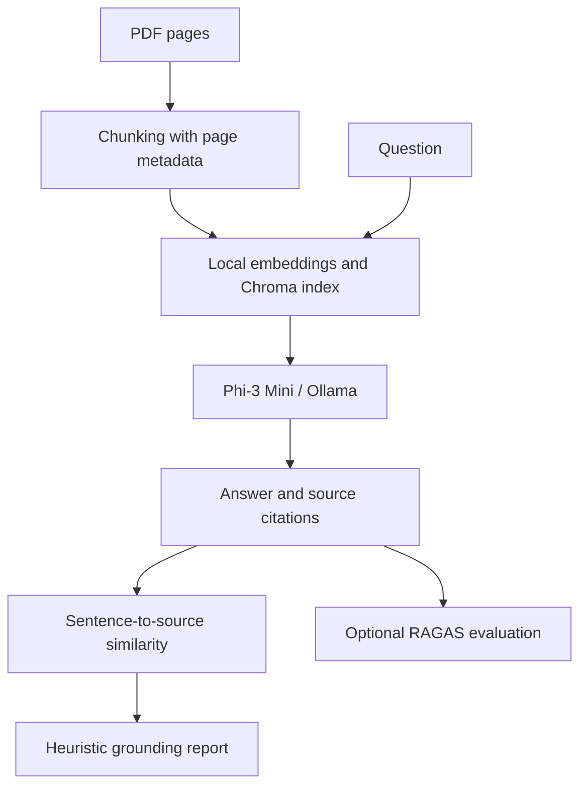

# TruthGuard

**Inspect the evidence behind a document-grounded answer.**

A local RAG research prototype that retrieves PDF context, generates an answer, maps citations and compares answer sentences with source chunks. My implementation separates ingestion, retrieval, citation mapping, similarity analysis, heuristic scoring and optional RAGAS evaluation.

**Python · LangChain · ChromaDB · Ollama · Streamlit · RAGAS**

## How it works



The application exposes intermediate evidence so a reader can inspect why a sentence was matched to a source. It does not independently fact-check the source itself.

## Implementation

| Component | Source |
| --- | --- |
| PDF text extraction and chunking | [ingestion/pdf_loader.py](ingestion/pdf_loader.py) |
| Persistent Chroma retrieval | [retrieval/vector_store.py](retrieval/vector_store.py) |
| Retrieval and generation workflow | [retrieval/rag_pipeline.py](retrieval/rag_pipeline.py) |
| Sentence-level citations | [retrieval/citation_mapper.py](retrieval/citation_mapper.py) |
| Similarity-based classifications | [hallucination_detection/detector.py](hallucination_detection/detector.py) |
| Weighted confidence heuristic | [evaluation/confidence_scorer.py](evaluation/confidence_scorer.py) |
| Optional RAGAS metrics | [evaluation/ragas_evaluator.py](evaluation/ragas_evaluator.py) |
| Streamlit interface | [frontend/app.py](frontend/app.py) |

Defaults in [config.py](config.py): `phi3:mini` for answers, `gemma3:1b` for evaluation and `BAAI/bge-small-en-v1.5` embeddings. Chunks are 512 characters with 64-character overlap; retrieval defaults to five chunks.

## Local setup

There is no verified hosted demo. Use Python 3.12, an isolated environment and a local [Ollama installation](https://ollama.com/download). Model downloads require network access and sufficient disk/memory.

```bash
git clone https://github.com/Laabh-Gupta/TruthGuard.git
cd TruthGuard
python -m venv .venv
```

Activate `.venv` for your shell. The original `requirements.txt` is a development-environment export containing a machine-local package path and Windows-specific packages; installing it unchanged on another machine may fail.

For a clean environment, install the directly used dependencies:

```bash
python -m pip install "numpy<2" torch streamlit==1.45.1 PyMuPDF==1.25.5 python-dotenv==1.1.0 langchain==0.3.25 langchain-community==0.3.23 langchain-huggingface==0.1.2 langchain-ollama==0.3.2 langchain-text-splitters==0.3.11 chromadb==0.6.3 sentence-transformers==3.4.1 ragas==0.2.15 datasets
ollama pull phi3:mini
ollama pull gemma3:1b
```

This is a dependency-based setup recipe, not a newly validated lockfile. Platform-specific PyTorch/native dependencies may require adjustment.

Start Ollama if it is not running. Before launching the app, set `CHROMA_PERSIST_DIR` in `config.py` to a new local directory such as `./local_chroma_db` so your run starts with your own documents rather than the committed sample index.

```bash
streamlit run frontend/app.py
```

Upload a text-readable PDF, ask a question, inspect source pages and sentence matches, then enable RAGAS if needed. The configured workflow uses local models and does not require an OpenAI API key.

## Evaluation & limitations

- **Similarity is not entailment.** Similar wording can still contradict a source or omit context. SUPPORTED/WEAK/UNSUPPORTED labels use thresholds, not verified factual judgments.
- The displayed confidence combines grounding and retrieval similarity with a penalty. It is not a calibrated probability of correctness.
- RAGAS can report faithfulness, answer relevancy and context precision. When no reference answer is supplied, this implementation substitutes the generated answer as ground truth. That limits independent evaluation.
- Earlier README scores were example observations, not a published benchmark with a fixed evaluation set. No aggregate benchmark is claimed here.
- PDFs without extractable text require a separate OCR step. Short sentences may be excluded by the splitter.
- The local vector index is shared across documents; the prototype does not provide account isolation or a production document-retention policy.
- Hardware, model versions and local dependency compatibility affect runtime. No fresh end-to-end model evaluation was run for this documentation revision.

The useful result is an inspectable pipeline and interface for exploring grounding, with its assumptions visible.
